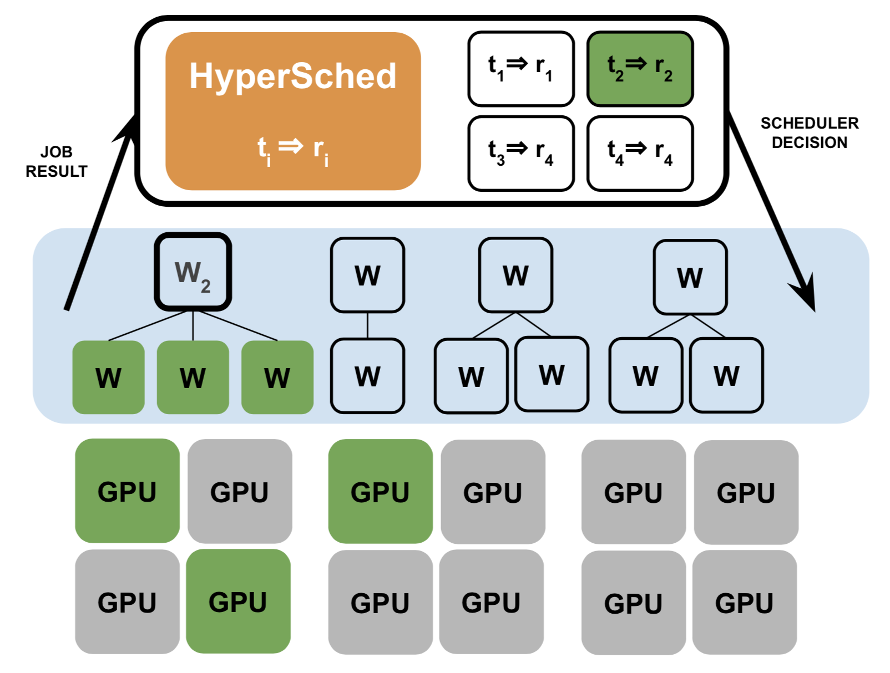

<div align="center">
   <p align="center"> <br></p>
</div>

# HyperSched

An experimental scheduler for accelerated hyperparameter tuning.

People: Richard Liaw, Romil Bhardwaj, Lisa Dunlap, Yitian Zou, Joseph E. Gonzalez, Ion Stoica, Alexey Tumanov

## Overview

HyperSched a dynamic application-level resource scheduler to track, identify, and preferentially allocate resources to the best performing trials to maximize accuracy by the deadline.

HyperSched is implemented as a `TrialScheduler` of [Ray Tune](http://tune.io/).

<div align="center">
   <p align="center"> <br></p>
</div>

HyperSched does so by resizing training jobs.

## Quick Start

Install with:

```bash
pip install ray==0.7.6
git clone https://github.com/ucbrise/hypersched && cd hypersched
pip install -e .
```


## Advanced Usage


HyperSched Imagenet Training on AWS

1. Create an EBS volume with ImageNet (https://github.com/pytorch/examples/tree/master/imagenet)
2. Set the EBS volume for all nodes of your cluster. For example, as seen in `scripts/imagenet.yaml`;

```yaml
head_node:
    InstanceType: p3.16xlarge
    ImageId: ami-0d96d570269578cd7
    BlockDeviceMappings:
      - DeviceName: "/dev/sdm"
        Ebs:
          VolumeType: "io1"
          Iops: 10000
          DeleteOnTermination: True
          VolumeSize: 250
          SnapshotId: "snap-01838dca0cbffad5c"

```
3. Run the following command:
```bash
python ~/sosp2019/scripts/evaluate_dynamic_asha.py \
    --redis-address="localhost:6379" \
    --num-atoms=16 \
    --num-jobs=200 \
    --seed=$1 \
    --sched hyper \
    --result-file=$LOGFILE \
    --max-t=$maxt \
    --global-deadline=$deadline \
    --trainable-id pytorch \
    --model-string $model \
    --data imagenet \
```

## TODOs

- [ ] Move PyTorch Trainable onto `ray.experimental.sgd`

## Cite

```
@inproceedings{Liaw:2019:HDR:3357223.3362719,
 author = {Liaw, Richard and Bhardwaj, Romil and Dunlap, Lisa and Zou, Yitian and Gonzalez, Joseph E. and Stoica, Ion and Tumanov, Alexey},
 title = {HyperSched: Dynamic Resource Reallocation for Model Development on a Deadline},
 booktitle = {Proceedings of the ACM Symposium on Cloud Computing},
 series = {SoCC '19},
 year = {2019},
 isbn = {978-1-4503-6973-2},
 location = {Santa Cruz, CA, USA},
 pages = {61--73},
 numpages = {13},
 url = {http://doi.acm.org/10.1145/3357223.3362719},
 doi = {10.1145/3357223.3362719},
 acmid = {3362719},
 publisher = {ACM},
 address = {New York, NY, USA},
 keywords = {Distributed Machine Learning, Hyperparameter Optimization, Machine Learning Scheduling},
}
```
